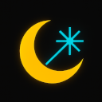

# MoonCutter - a GUI for the K3 Laser Engraver

STILL UNDER DEVELOPMENT!

Binaries available https://postincrement.github.io/mooncutter/

## Features

- Cross platform thanks to ElectronJS
- Engrave bitmaps and text

# To-Do

- Add a fan button to the engrave tab 
- Make rotation use centre of object
- Save and load projects and settings

## Thanks!

This program would not have been possible without the work of Marcel Ochsendorf who reverse engineered the protocol.

His project has more information:

  https://github.com/RBEGamer/K3_LASER_ENGRAVER_PROTOCOL

## Running from source

This is a normal ElectronJS program so the usual instructions apply.

### Installation

1. Make sure you have [Node.js](https://nodejs.org/) installed
2. Clone this repository
3. Install dependencies:
```bash
npm install
```

### Running the Application

To start the application, run:
```bash
npm start
```

### Debugging

There are several ways to debug the application:

1. Main Process Debugging:
```bash
npm run debug        # Start with debugger attached
npm run debug-brk    # Start with debugger attached and break on first line
```

2. To debug the main process:
   - Start the app with `npm run debug`
   - Open Chrome and navigate to `chrome://inspect`
   - Click on "Open dedicated DevTools for Node"

3. To debug the renderer process:
   - Start the app normally
   - Press Ctrl+Shift+I (Windows/Linux) or Cmd+Option+I (macOS) to open DevTools
   - Or use the debug mode which opens DevTools automatically

## Building Native Applications

MoonCutter can be packaged as a native application for macOS and Windows using electron-builder.

### Prerequisites

- Node.js and npm installed
- For Windows builds on macOS/Linux: Wine installed

### Building for macOS

```bash
npm run package:mac
```

This creates a `.dmg` installer in the `dist` folder.

### Building for Windows

```bash
npm run package:win
```

This creates a Windows installer in the `dist` folder.

If you are building the Windows installer on MacOS, and the installed program crashes with an error about 
binding.node not being a valid Win32 program, run the following command rebuild the installer:

```base
rm -rf node_modules/\@serialport/bindings-cpp/build/Release/bindings.node
```

### Building for Both Platforms

```bash
npm run package
```

This builds installers for all configured platforms.

### Creating icons 

For MacOS:

  - ensure the icons are in `images/icon.iconset` as `.png` files
  - run the command in the `images` directory

  ```bash
  iconutil -c icns icon.iconset
  ```

For Windows:  
  - the icon is in `images/icon.ico`